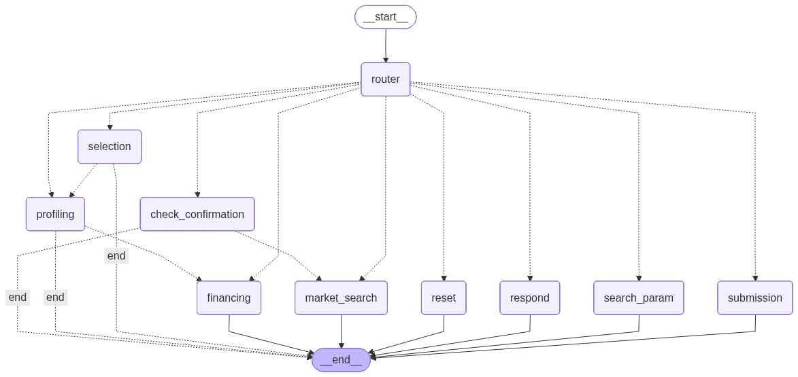

# 🚗 AutoFinance AI Agent ("Financial Co-Pilot")


> **A State-of-the-Art Agentic Workflow for the Egyptian Vehicle Market**

The **AutoFinance AI Agent** is an autonomous "Financial Co-Pilot" designed to bridge the gap between vehicle discovery and financing in Egypt. It guides users through a complete journey: finding cars on fragmented marketplaces (Hatla2ee, Dubizzle), retrieving specific credit policies via RAG, calculating precise monthly installments, and submitting high-intent applications for back-office review.

---

## 🚀 Key Features

*   **🔍 Market Discovery**: Real-time aggregation of vehicle listings from Egyptian marketplaces using Tavily API.
*   **🧠 Intelligent Routing**: Context-aware routing using LLM classification to direct users between onboarding, searching, profiling, and financing.
*   **🛡️ Policy Enforcement (RAG)**: Retrieves and applies internal credit policies (interest rates, DBR limits) based on user profile and vehicle age.
*   **🧮 Loan Quotation**: Precise calculation of monthly installments using the PMT formula and affordability checks.
*   **📝 Lead Capture**: Seamlessly captures user intent, validates decisions via LLM, and submits formal applications to **Supabase**.
*   **💾 State Persistence**: Remembers user context (selected car, income, employment) across sessions using SQLite checkpoints.
*   **🚦 Human-in-the-Loop**: Explicit validation steps before executing searches or submitting sensitive applications.

---

## 🏗️ Technical Architecture

This project is built on the **DataRobot Agentic Workflow** template using **LangGraph**.

### Workflow Graph
The agent follows a structured directed cyclic graph (DCG) to manage state and transitions:



### State Management (`AgentState`)
The agent maintains a rich persisting state object:

| Field | Type | Description |
| :--- | :--- | :--- |
| `messages` | `list` | Conversation history (Human/AI messages). |
| `search_params` | `dict` | Extracted criteria (make, model, budget) for vehicle search. |
| `search_results` | `list` | Raw vehicle listings from Tavily search. |
| `search_confirmed` | `bool` | Flag indicating user approved the search parameters. |
| `selected_vehicle` | `Vehicle` | Structured object of the user's chosen car. |
| `user_profile` | `UserProfile` | Income, employment type, DBR, and contact info. |
| `eligible_policies` | `list` | Credit policies retrieved dynamically via RAG. |
| `generated_quotes` | `list` | Calculated loan options (Installment, Tenure, Rate). |
| `awaiting_submission` | `bool` | Flag indicating the user is viewing quotes and might submit. |
| `_next_node` | `str` | Internal routing decision from Router node. |

### Technology Stack

| Component | Technology | Description |
| :--- | :--- | :--- |
| **Orchestration** | **LangGraph** | State-based graph managing the 5-phase user journey. |
| **Reasoning** | **DataRobot LLM Gateway** | Access to hosted LLMs (e.g., GPT-4o) with reliability guards. |
| **Database** | **Supabase** | Relational DB (Postgres) for storing submitted lead applications. |
| **Memory** | **SQLite** | `langgraph.checkpoint.sqlite` for session state persistence. |
| **Search** | **Tavily API** | Optimized search for parsing unstructured vehicle listing data. |
| **Compute** | **DataRobot Custom Models** | Serverless runtime for hosting the agent logic. |

---

## 📂 Project Structure

```
agent_langgraph/
├── agentic_workflow/
│   ├── agent.py              # 🧠 Main StateGraph definition & Agent class
│   ├── models.py             # 📦 Pydantic data models (State, Vehicle, Quote)
│   ├── config.py             # ⚙️ Configuration & Environment variables (Supabase, etc.)
│   ├── nodes/                # 📍 Graph Nodes (Functional Units)
│   │   ├── router.py         #    → Intent routing
│   │   ├── search_param.py   #    → LLM parameter extraction
│   │   ├── confirmation.py   #    → Search execution confirmation
│   │   ├── market_search.py  #    → Tavily search execution
│   │   ├── selection.py      #    → Vehicle selection logic
│   │   ├── profiling.py      #    → User profiling & iteration
│   │   ├── financing.py      #    → Policy Retrieval & Quotation
│   │   ├── submission.py     #    → Supabase data write (LLM-detected)
│   │   ├── respond.py        #    → Conversational response generation
│   │   └── reset.py          #    → State reset logic
│   ├── tools/                # 🛠️ Tool Implementations
│   │   ├── tavily_search.py  #    → Search API wrapper
│   │   ├── policy_retriever.py #  → Vector DB RAG tool
│   │   ├── calculator.py     #    → Loan math tool
│   │   └── supabase_client.py#    → Database connector
│   └── custom.py             # 🔌 DataRobot hooks
├── tests/                    # 🧪 Unit tests & Integration tests
└── Taskfile.yml              # 📋 Build & Run commands
```

---

## 🛠️ Setup & Installation

### 1. Prerequisites
*   Python 3.11+
*   [uv](https://docs.astral.sh/uv/) (Dependency Manager)
*   [Taskfile](https://taskfile.dev/) (Command Runner)

### 2. Configure Environment
Create a `.env` file in the root directory:

```bash
cp .env.template .env
```

Populate the following secrets:

```bash
# DataRobot (Compute & LLM)
DATAROBOT_API_TOKEN=...
DATAROBOT_ENDPOINT=...

# Tools
TAVILY_API_KEY=tvly-...
DATAROBOT_VECTOR_DB_ID=...

# Lead Capture (Supabase)
SUPABASE_URL=https://your-project.supabase.co
SUPABASE_KEY=your-anon-key
```

### 3. Install Dependencies
```bash
task agent_langgraph:install
```

### 4. Database Setup (Supabase)
Create a table `applications` in your Supabase project with the following columns:
*   `id` (uuid, primary key)
*   `created_at` (timestamptz)
*   `session_id` (text)
*   `user_name` (text)
*   `contact_phone` (text)
*   `monthly_income` (numeric)
*   `vehicle_make` (text)
*   `quote_monthly_installment` (numeric)
*   `status` (text) - Default: 'pending_review'

---

## 🧪 Testing

### Unit & Integration Tests
Run the comprehensive test suite (including live Supabase integration):
```bash
task agent_langgraph:test
```

### Local Development Server
Start the hot-reloading dev server:
```bash
task agent_langgraph:dev
```

### ChainLit UI (Interactive Playground)
For a chat interface similar to production:
```bash
task agent_langgraph:chainlit
```

---

## 📦 Deployment

Deploy to DataRobot Custom Models:

```bash
task deploy
```
This will containerize the agent, upload it to DataRobot, and deploy it as a prediction API.

---

## 🤝 Contributing

We welcome contributions! Please follow these steps:
1.  Fork the repository.
2.  Create a feature branch (`git checkout -b feature/AmazingFeature`).
3.  Commit your changes (`git commit -m 'Add some AmazingFeature'`).
4.  Push to the branch (`git push origin feature/AmazingFeature`).
5.  Open a Pull Request.

## 📄 License

Distributed under the Apache 2.0 License. See `LICENSE` for more information.

## 🆘 Support

If you encounter any issues or have questions, please file an issue in the [GitHub Issue Tracker](https://github.com/datarobot/AutoFinance-AI-Agent/issues).

## 👥 Maintainers

*   **Amr Saud** - *Initial Work* - [amrsaud](https://github.com/amrsaud)

---

## 📄 Documentation Links
*   [Product Requirements (PRD)](./PRD.md)
*   [Technical Design](./TECHNICAL_DESIGN.md)
*   [LangGraph Documentation](https://langchain-ai.github.io/langgraph/)
