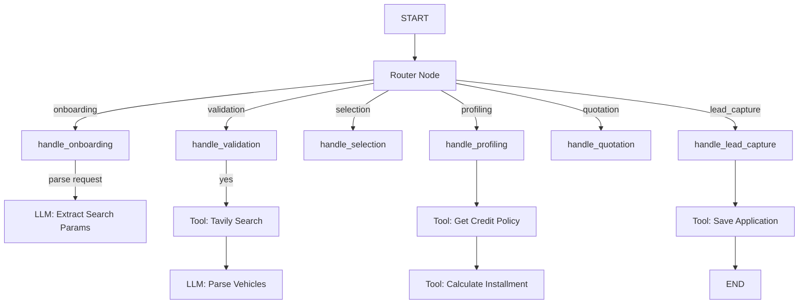

# AutoFinance AI Agent

Transform the existing LangGraph template into a "Financial Co-Pilot" agent that helps Egyptian users discover vehicles, calculate loan eligibility, and submit pre-approval applications.

---

## Architecture Overview



---

## Component Structure

### 1. State & Configuration

#### [state.py](file:///Users/amrsaud/Desktop/AutoFinance-AI-Agent/agent_langgraph/agentic_workflow/state.py)
Defines all structured schemas:
- `Vehicle` - Vehicle listing data
- `SearchParams` - Formalized search criteria
- `CustomerInfo` - Lead capture data
- `CreditPolicy` - RAG-retrieved policy rules
- `FinancialQuote` - Calculated loan terms
- `AutoFinanceState` - Main workflow state (TypedDict)

#### [config.py](file:///Users/amrsaud/Desktop/AutoFinance-AI-Agent/agent_langgraph/agentic_workflow/config.py)
Configuration parameters:
- `tavily_api_key` - Tavily search API
- `supabase_url` / `supabase_key` - Database connection
- `vectordb_deployment_id` - DataRobot VectorDB for RAG
- `llm_deployment_id` - LLM gateway deployment

---

### 2. Tools

| Tool | File | Description |
|------|------|-------------|
| `search_vehicles` | [tavily_search.py](file:///Users/amrsaud/Desktop/AutoFinance-AI-Agent/agent_langgraph/agentic_workflow/tools/tavily_search.py) | Searches Egyptian marketplaces (Hatla2ee, Dubizzle) via Tavily API. Returns raw search snippets. |
| `get_credit_policy` | [policy_rag.py](file:///Users/amrsaud/Desktop/AutoFinance-AI-Agent/agent_langgraph/agentic_workflow/tools/policy_rag.py) | Retrieves credit policy from VectorDB. Returns eligibility status and rates. |
| `calculate_installment` | [calculator.py](file:///Users/amrsaud/Desktop/AutoFinance-AI-Agent/agent_langgraph/agentic_workflow/tools/calculator.py) | Calculates EMI using standard amortization formula. |
| `check_debt_burden_ratio` | [calculator.py](file:///Users/amrsaud/Desktop/AutoFinance-AI-Agent/agent_langgraph/agentic_workflow/tools/calculator.py) | Validates DBR against policy limits. |
| `save_application` | [supabase_client.py](file:///Users/amrsaud/Desktop/AutoFinance-AI-Agent/agent_langgraph/agentic_workflow/tools/supabase_client.py) | Saves lead to Supabase. Returns request ID (e.g., `AF-260120-1234`). |
| `check_application_status` | [supabase_client.py](file:///Users/amrsaud/Desktop/AutoFinance-AI-Agent/agent_langgraph/agentic_workflow/tools/supabase_client.py) | Queries existing application status. |

---

### 3. Agent Workflow

#### [agent.py](file:///Users/amrsaud/Desktop/AutoFinance-AI-Agent/agent_langgraph/agentic_workflow/agent.py)

**Single-Turn Architecture**: The agent uses a router pattern where each invocation processes one user message and returns a response. State is persisted externally (Chainlit session).

**Phase Handlers**:
| Phase | Handler | Description |
|-------|---------|-------------|
| `onboarding` | `_handle_onboarding` | Welcome, parse search request or check status |
| `validation` | `_handle_validation` | Confirm search params, execute search |
| `selection` | `_handle_selection` | User picks a vehicle |
| `profiling` | `_handle_profiling` | Collect income, employment type |
| `quotation` | `_handle_quotation` | Show loan terms, get confirmation |
| `lead_capture` | `_handle_lead_capture` | Collect contact info, submit |

**LLM Parsing**:
- `_parse_search_request` - Extracts `SearchParams` from natural language
- `_parse_vehicles_with_llm` - Converts raw Tavily snippets to structured `Vehicle` objects

---

### 4. Chainlit Integration

#### [lit.py](file:///Users/amrsaud/Desktop/AutoFinance-AI-Agent/agent_langgraph/lit.py)

- Uses `graph.astream` for real-time streaming
- `LangchainCallbackHandler` for tool visibility in UI
- Displays human-readable steps for:
  - Phase transitions
  - Extracted search criteria
  - Selected vehicle details
  - Loan calculations

---

### 5. Database Schema

#### Supabase `applications` Table

```sql
CREATE TABLE applications (
    id UUID DEFAULT gen_random_uuid() PRIMARY KEY,
    request_id VARCHAR(20) UNIQUE NOT NULL,
    status VARCHAR(20) DEFAULT 'pending_review',
    
    -- Customer info
    customer_name VARCHAR(255) NOT NULL,
    customer_email VARCHAR(255) NOT NULL,
    customer_phone VARCHAR(20) NOT NULL,
    
    -- Vehicle info
    vehicle_name VARCHAR(255) NOT NULL,
    vehicle_price DECIMAL(15,2) NOT NULL,
    vehicle_year INTEGER NOT NULL,
    
    -- Financial quote
    monthly_income DECIMAL(15,2) NOT NULL,
    employment_type VARCHAR(50) NOT NULL,
    interest_rate DECIMAL(5,2) NOT NULL,
    tenure_months INTEGER NOT NULL,
    monthly_installment DECIMAL(15,2) NOT NULL,
    
    created_at TIMESTAMPTZ DEFAULT NOW()
);
```

---

## Environment Variables

```bash
# Required
TAVILY_API_KEY=your_tavily_key
SUPABASE_URL=https://your-project.supabase.co
SUPABASE_KEY=your_supabase_anon_key
VECTORDB_DEPLOYMENT_ID=your_vectordb_deployment
llm_deployment_id=your_llm_deployment

# DataRobot
DATAROBOT_API_TOKEN=your_token
DATAROBOT_ENDPOINT=https://app.datarobot.com
```

---

## Running the Agent

### Development Server
```bash
cd agent_langgraph
uv run chainlit run --host 0.0.0.0 --port 8083 lit.py -w
```

### CLI Testing
```bash
cd agent_langgraph
uv run python test_cli.py
```

---

## Verification Checklist

- [x] Vehicle search returns real results from Tavily
- [x] LLM parses search results into structured vehicles
- [x] Credit policy lookup works via RAG tool
- [x] EMI calculation matches expected formula
- [x] Application saves to Supabase with auto-generated request ID
- [x] Status check retrieves saved applications
- [x] Chainlit UI shows intermediate steps
- [x] Full E2E flow completes successfully
